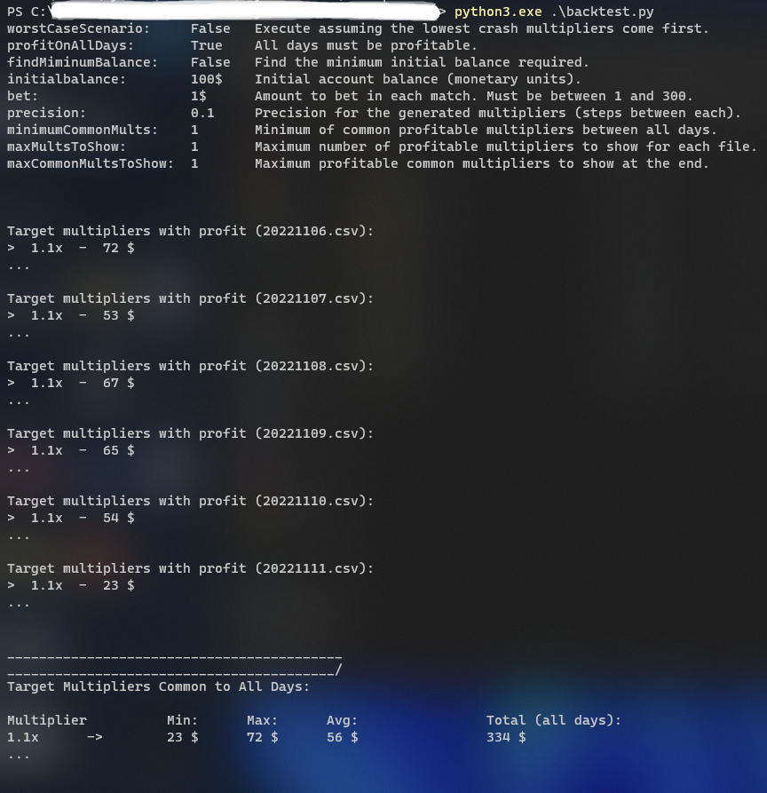

# AAX-SpaceRun-Analyzer

This project consists of two main <ins>**Python3**</ins> scripts, ``main.py`` and ``backtest.py``, and aims to collect information from the [AAX SpaceRun](https://www.aax.com/en-US/campaign/game/spacerun/) game and calculate the best user parameters for the game, based on the data collected.

The theme of this game is set in Space, where the spaceship (allegedly) has random chances of crashing - it's a gambling game. While the spaceship is flying, there is a counter which represents the multiplier that will be applied to the user's bet, once the spaceship crashes.
If, for example, the user bets ``$1`` and has a target multiplier of ``2.00x`` and the crash multiplier is ``2.01x``, he will receive ``1*2.01 = $2.01`` (a profit of ``$1.01``). Otherwise, if the crash multiplier is below or equal to his target multiplier, the user will lose his bet.

---
### main.py
- Will execute an infinite loop that, for each iteration, will create a connection with AAX's websocket, send a request for information and parse all incoming messages, waiting for the one with the expected structure.
- After receiving and saving the relevant information, the connection to the websocket will be closed, and the program will sleep for 50 seconds (each game match has an initial countdown of 5s and the message contains the data from the 10 latest matches).

- The Websocket:
    - Using Google Chrome's DevTools (aka Inspector), we are able to capture all the messages transmitted and received by the website. This way we can see that the websocket URL is ``wss://gaming-svc.aax.com`` and all messages are sent in Base64 to the server, and received in JSON (text format) from the server.
    - Using Postman, we can analyze what each initial message sent to the server does, and so I was able to figure out there is a specific message that starts the streaming of live game data (it's basically logging in), and then there is another message that requests the server a list of the 10 most recent crash multipliers. That is all we need.

---
### backtest.py
- This script goes through all the CSV files in the ``multiplier-logs`` directory and calculates possible profits on the past recorded days, based on the user's parameters/options, which can be manually changed in the beginning of the file. Those options allow the user to simulate different strategies, adjust the amount of information shown, and adjust the parameters of the test.
- Main use cases:
    - Test the profitability of a specific betting amount for each match, with a specific initial account balance
    - Calculate the minimum initial account balance in order to achieve profit
- These tests can be tuned to require all days to be profitable, or to calculate for the worst case scenario (in which the lower crash multipliers come first)

---
### Example result from backtest.py:

    

- This is the result of a test that calculates the minimum initial account balance that allows for all days to be profitable and which multipliers are profitable in all days. 
- This tells us that if a user were to bet $1 in every match of the day, with a target multiplier of 1.1x, he would end the day with profit.
- It is important to note that this searches for the first multiplier that was profitable in all days. Once it is found, the test is terminated. This multiplier is not necessarily the most profitable of all (although, during development, I noticed the trend was that higher multipliers represented lower profit)

---
### Possible modifications
- Make it possible to set a specific target multiplier, or set a range of multipliers to test
- Have an option to show unprofitable multipliers and their respective amount lost
- Have an option to calculate the most profitable multiplier on each day
- Have an option to divide the list of daily multipliers into multiple same-size segments and rotate them between each test

---
### List of other Base64 requests to the websocket that I captured and tested
``FAAAABcAAAB7InBhZ2UiOiIxIn0=``  -  get list of participants of the current match and their respective bets

``FAAAABkAAAB7InBhZ2UiOiIyIn0=``  -  get the second page of the multiplier history (the oldest 10 of the 20 most recent multipliers)
